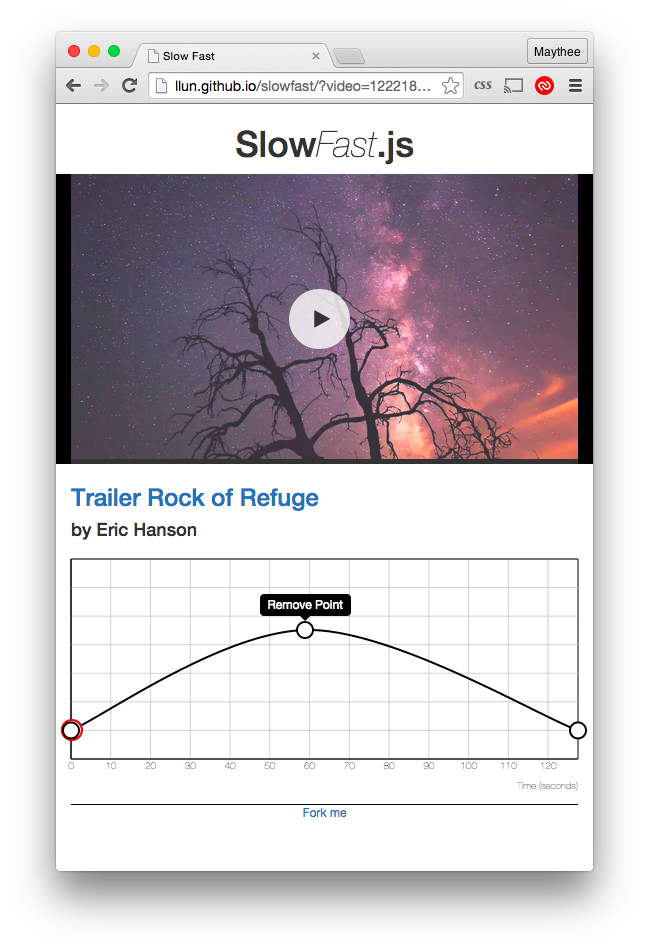

# SlowFast.JS

This Github page is an app base on idea from [iOS app the same name.](http://www.studioneat.com/products/slowfast) 
Currently video can play from Vimeo by passing id to the url e.g. [http://llun.github.io/slowfast/?video=122218691](http://llun.github.io/slowfast/?video=122218691) and it will load video with normal rate play. Current default video is from [Eric Hanson](https://vimeo.com/122218691)

## Usage

Video playback rate can adjust by adding/removing point in the below graph. To adding point, press in the graph for 2 second, it will
add the point and show menu for confirming. Clicking somewhere else in grph will cancel adding point.

To remove point, click on the point you want to remove and confirm by clicking the popup. Point cannot remove if it has less than 2.

Point can drag to adjust speed and time and if move the first/last point it will trim the video.

# License

[MIT](http://llun.mit-license.org/)